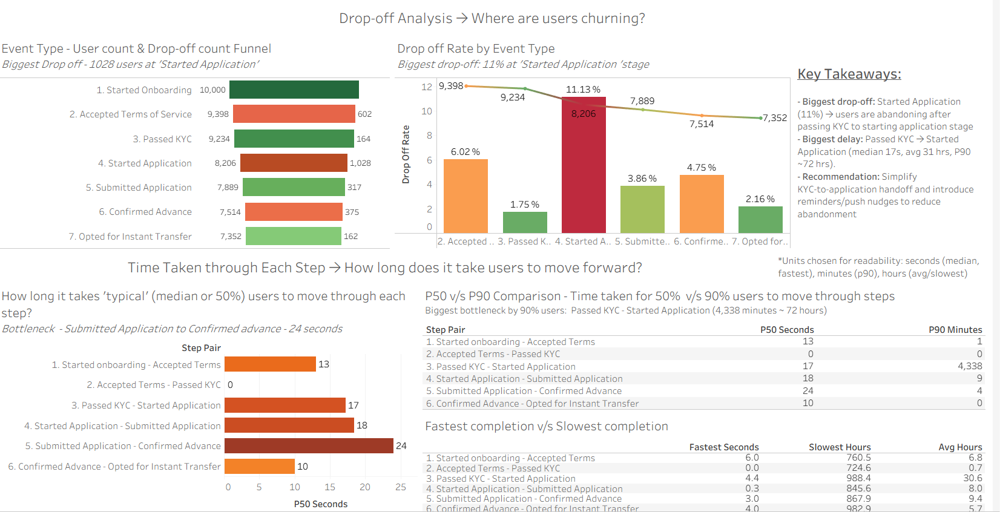
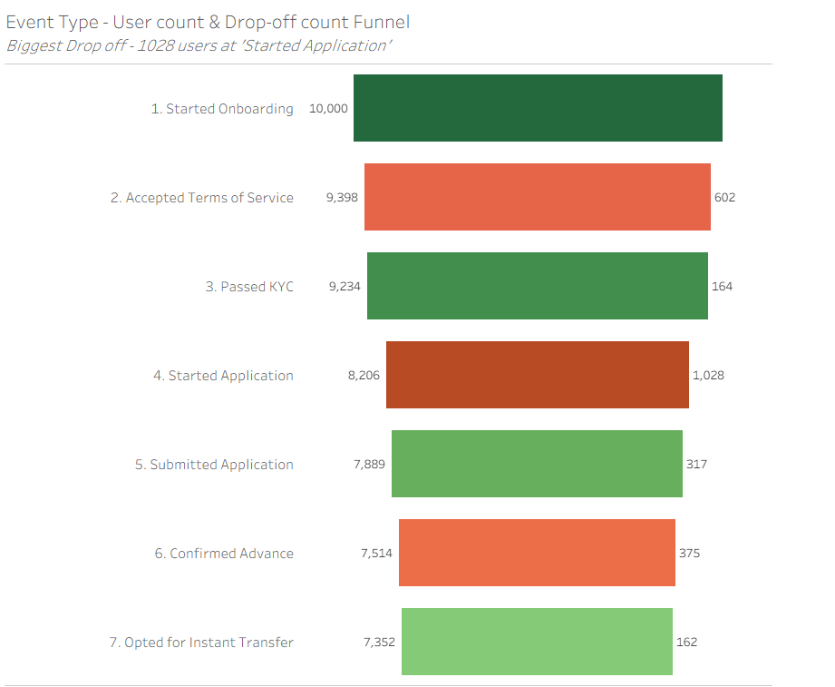
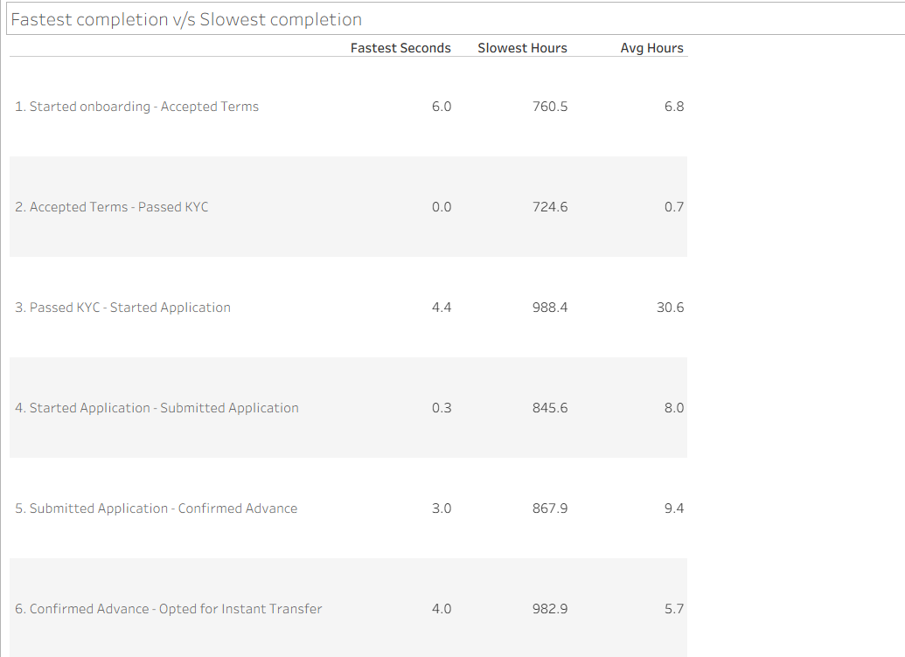

# fintech-onboarding-funnel-analysis
Product analytics case study analyzing an Earned Wage Access onboarding funnel using SQL to identify user drop-off, conversion bottlenecks, and opportunities to improve activation.

# Earned Wage Access (EWA) Onboarding Funnel Analysis

## Overview

User onboarding is one of the most critical stages of the customer journey, directly influencing product adoption and long-term engagement. This project analyzes the embedded onboarding and application flow for an Earned Wage Access (EWA) product, where hourly workers can access wages they have already earned through their payroll or time-tracking platform. Using SQL and Tableau, the analysis identifies user drop-off, measures conversion and time taken between onboarding stages, and provides actionable recommendations to improve user activation and advance completion. The findings help product teams prioritize feature development by focusing on the highest-friction stages of the onboarding journey.

---
## Dashboard



## Funnel Analysis



## Time Analysis



---
## Business Problem

The objective of this analysis was to answer the following questions:

* Where are users dropping off during onboarding?
* Which stages of the funnel create the most friction?
* How long does it take users to progress between onboarding steps?
* Which bottlenecks have the greatest impact on overall conversion?
* Which product improvements should be prioritized?

---

## Dataset

The analysis uses event-level onboarding data where each record represents a user action during the onboarding journey.

The onboarding funnel consists of seven key events:

1. Started Onboarding
2. Accepted Terms of Service
3. Passed KYC
4. Started Application
5. Submitted Application
6. Confirmed Advance
7. Opted for Instant Transfer

---

## Tech Stack

* SQL (PostgreSQL)
* Tableau
* Git & GitHub

---

## Methodology

The analysis was completed using the following workflow:

* Performed data quality checks for null values, duplicate records, and event inconsistencies.
* Cleaned the dataset by correcting event name inconsistencies and converting timestamps.
* Reconstructed the complete onboarding funnel.
* Calculated step-level user counts, conversion rates, and drop-off percentages.
* Measured user progression time between consecutive onboarding events using median (P50), P90, average, minimum, and maximum completion times.
* Built Tableau dashboards to visualize funnel performance and onboarding bottlenecks.
* Translated analytical findings into product recommendations.

---

## Key Metrics

* Funnel Conversion Rate
* Step-wise Drop-off Rate
* User Count by Funnel Stage
* Median (P50) Time Between Steps
* P90 Time Between Steps
* Average Completion Time

---

## Key Findings

* The largest drop-off occurred between **Passed KYC → Started Application**, where approximately **11% of users (1,028)** abandoned the onboarding journey.
* A secondary drop-off occurred between **Started Onboarding → Accepted Terms of Service**.
* Overall funnel conversion from onboarding start to completion was approximately **74%**.
* Although most users completed onboarding steps within seconds, the **Passed KYC → Started Application** transition showed significant delays for the slowest users (P90 ≈ 72 hours), indicating a major product bottleneck.
* Time-based analysis highlighted that average completion times were heavily skewed by outliers, making median and P90 metrics more representative of the user experience.

---

## Recommendations

Based on the analysis, the following improvements are recommended:

* Streamline the transition from KYC completion to application start.
* Simplify the application experience to reduce abandonment.
* Re-engage inactive users through reminder notifications or emails.
* Continuously monitor funnel conversion, drop-off rates, and time-to-completion to evaluate the impact of product changes.
* Prioritize improvements to the KYC → Application transition before addressing downstream friction points.

---

## Repository Structure


## Repository Structure

```text
README.md
Onboarding_Funnel_Analysis.sql
Onboarding_Funnel_Analysis.twbx
Onboarding_Funnel_Analysis_Presentation.pdf
dashboard.png
dropoff_funnel.png
time_taken.png
```

---

## Skills Demonstrated

* Product Analytics
* Funnel Analysis
* SQL (PostgreSQL)
* Data Cleaning & Validation
* Event Data Analysis
* User Journey Analysis
* KPI Development
* Tableau Dashboarding
* Business Storytelling
* Product Recommendations
* Data-Driven Decision Making


**Mukta Deshmukh**

Data Analytics | Product Analytics | Business Intelligence

**Tools:** SQL • PostgreSQL • Tableau • Git
